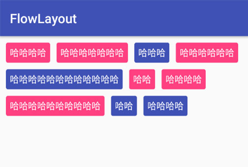
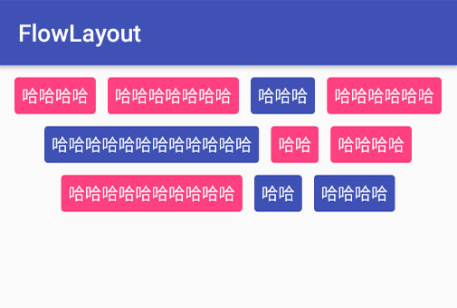
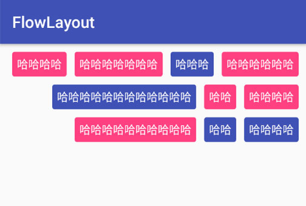

FlowLayout
=========





## How to use

### attrs:
```xml
<declare-styleable name="FlowLayout">
    <attr name="FLGravity" format="string" />       //排列方式，left/center/right
    <attr name="FLGapX" format="dimension" />       //X轴方向的间距
    <attr name="FLGapY" format="dimension" />       //Y轴方向的间距
</declare-styleable>
```

### layout:
```xml
<com.vinnie.weight.FlowLayout
    android:layout_width="match_parent"
    android:layout_height="wrap_content"
    android:layout_margin="10dp"
    app:FLGapX="10dp"
    app:FLGapY="10dp"
    app:FLGravity="@string/gravity_left">

    <TextView
        android:layout_width="wrap_content"
        android:layout_height="wrap_content"
        android:padding="6dp"
        android:text="哈哈哈哈"
        android:textColor="@android:color/white"
        android:background="@drawable/bg1"/>

    <TextView
        android:layout_width="wrap_content"
        android:layout_height="wrap_content"
        android:padding="6dp"
        android:text="哈哈哈哈哈哈哈"
        android:textColor="@android:color/white"
        android:background="@drawable/bg1"/>

    <TextView
        android:layout_width="wrap_content"
        android:layout_height="wrap_content"
        android:padding="6dp"
        android:text="哈哈哈"
        android:textColor="@android:color/white"
        android:background="@drawable/bg2"/>

    <TextView
        android:layout_width="wrap_content"
        android:layout_height="wrap_content"
        android:padding="6dp"
        android:text="哈哈哈哈哈哈"
        android:textColor="@android:color/white"
        android:background="@drawable/bg1"/>

    <TextView
        android:layout_width="wrap_content"
        android:layout_height="wrap_content"
        android:padding="6dp"
        android:text="哈哈哈哈哈哈哈哈哈哈哈哈"
        android:textColor="@android:color/white"
        android:background="@drawable/bg2"/>

    <TextView
        android:layout_width="wrap_content"
        android:layout_height="wrap_content"
        android:padding="6dp"
        android:text="哈哈"
        android:textColor="@android:color/white"
        android:background="@drawable/bg1"/>

    <TextView
        android:layout_width="wrap_content"
        android:layout_height="wrap_content"
        android:padding="6dp"
        android:text="哈哈哈哈"
        android:textColor="@android:color/white"
        android:background="@drawable/bg1"/>

    <TextView
        android:layout_width="wrap_content"
        android:layout_height="wrap_content"
        android:padding="6dp"
        android:text="哈哈哈哈哈哈哈哈哈哈"
        android:textColor="@android:color/white"
        android:background="@drawable/bg1"/>

    <TextView
        android:layout_width="wrap_content"
        android:layout_height="wrap_content"
        android:padding="6dp"
        android:text="哈哈"
        android:textColor="@android:color/white"
        android:background="@drawable/bg2"/>

    <TextView
        android:layout_width="wrap_content"
        android:layout_height="wrap_content"
        android:padding="6dp"
        android:text="哈哈哈哈"
        android:textColor="@android:color/white"
        android:background="@drawable/bg2"/>

</com.vinnie.weight.FlowLayout>
```

License
=======

    Copyright 2018 LVinnie

    Licensed under the Apache License, Version 2.0 (the "License");
    you may not use this file except in compliance with the License.
    You may obtain a copy of the License at

       http://www.apache.org/licenses/LICENSE-2.0

    Unless required by applicable law or agreed to in writing, software
    distributed under the License is distributed on an "AS IS" BASIS,
    WITHOUT WARRANTIES OR CONDITIONS OF ANY KIND, either express or implied.
    See the License for the specific language governing permissions and
    limitations under the License.


[](https://android-arsenal.com/details/1/1433)
